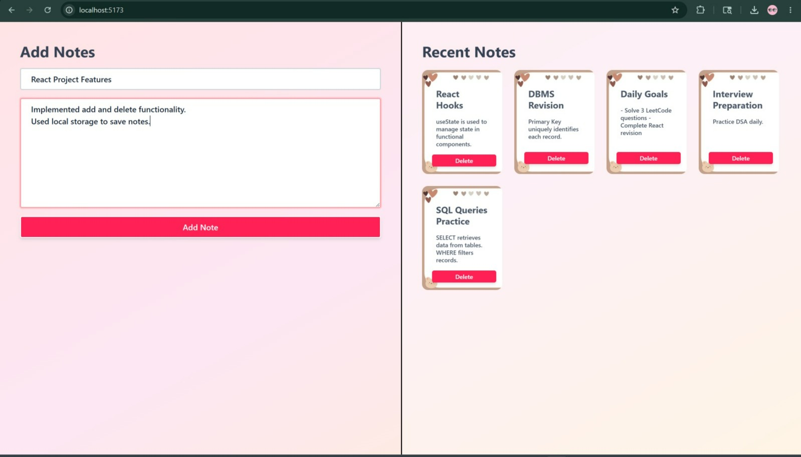

## 📝 `09-notes-app` — Notes App

A beautifully designed personal notes application with a warm aesthetic, allowing users to quickly add, view, and delete notes — all persisted via LocalStorage.

### 🖼️ Preview



### ✨ Features

- ✏️ **Add Notes** — Enter a title and body text to create a new note
- 🗑️ **Delete Notes** — Remove any note instantly with a single click
- 💾 **LocalStorage Persistence** — Notes survive page refreshes automatically
- 🃏 **Card-Based Display** — Notes displayed as stylish cards with decorative heart icons
- 🎨 **Warm Design** — Soft pink-to-peach gradient background with a cozy feel
- 📐 **Split Layout** — Left panel for input, right panel for viewing all saved notes
- 📋 **Recent Notes Grid** — Notes appear in a responsive grid sorted by recency

### 🏗️ Project Structure

```
09-notes-app/
├── public/
│   └── index.html
├── src/
│   ├── App.jsx
│   └── main.jsx
├── package.json
└── vite.config.js
```

### 🚀 Getting Started

```bash
# Navigate into the project
cd 09-notes-app

# Install dependencies
npm install

# Start the development server
npm run dev
```

Open [http://localhost:5173](http://localhost:5173) in your browser.

### 💡 Key React Concepts Used

- **`useState`** — Managing form input and the list of notes in real time
- **`useEffect`** — Syncing notes with LocalStorage whenever state changes
- **LocalStorage API** — `setItem` / `getItem` for client-side persistence
- **Controlled Components** — Input fields fully tied to React state
- **Array `.filter()`** — Removing a specific note on delete by ID

### 📦 Note Data Structure

```js
{
  id: Date.now(),
  title: "React Hooks",
  body: "useState is used to manage state in functional components."
}
```

---

## 🛠️ Tech Stack

| Technology | Purpose |
|------------|---------|
| **React.js** | UI library for building component-based interfaces |
| **Vite** | Fast development build tool and dev server |
| **JSX** | JavaScript XML syntax for writing components |
| **CSS3** | Styling, gradients, and layout |
| **LocalStorage** | Client-side data persistence (Notes App) |

---

## 🚀 Running All Projects Locally

```bash
# Clone this repository
git clone https://github.com/your-username/react-projects.git
cd react-projects

# Run Job Board
cd CardProject
npm install && npm run dev

# Run Notes App (open a new terminal)
cd ../09-notes-app
npm install && npm run dev
```

---